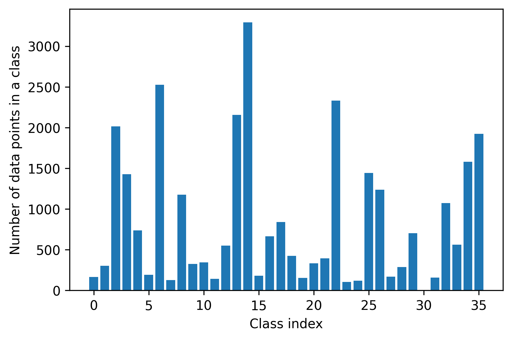
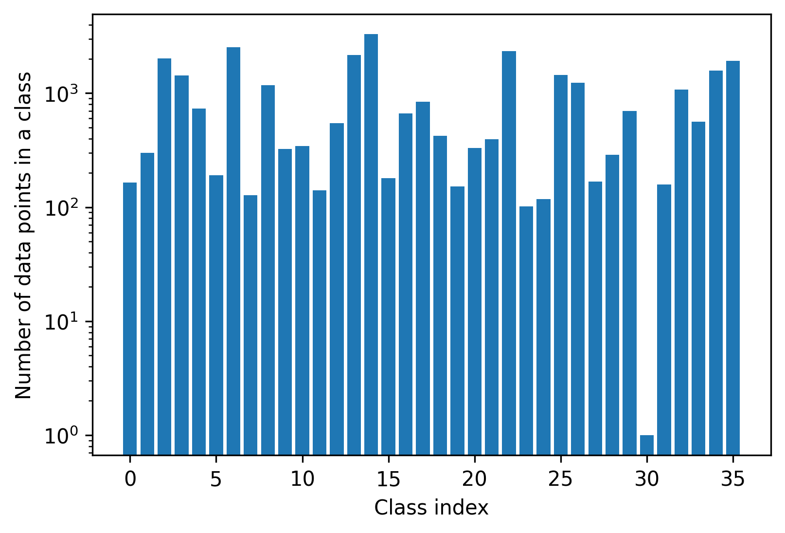
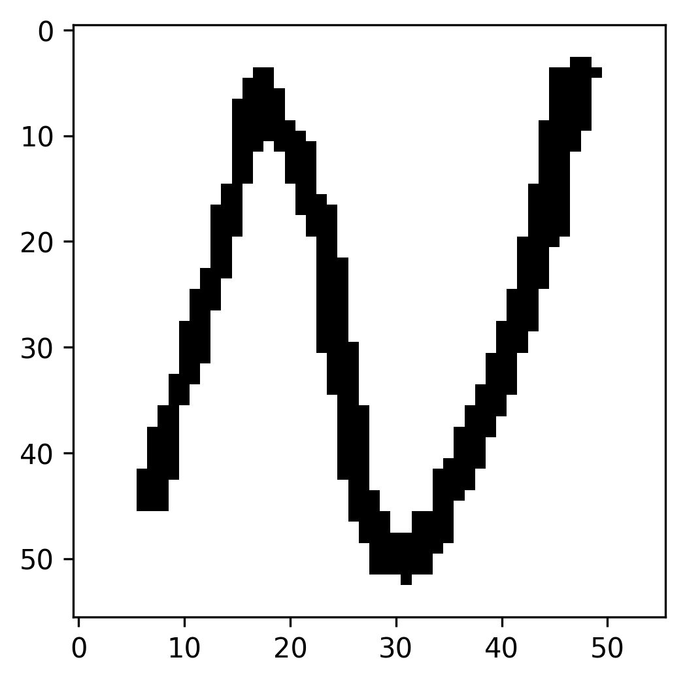
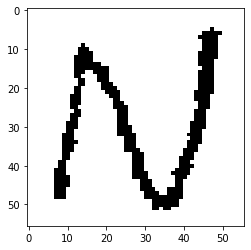
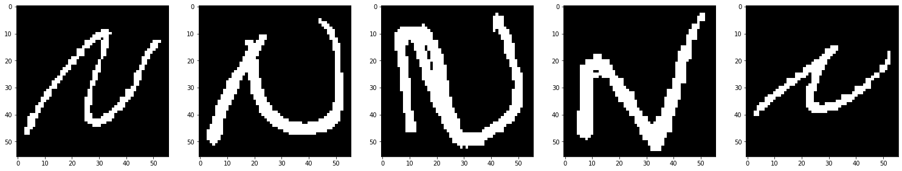

Dataset
=======

The plots below present the number of data points per class in linear (left) and logarithmic (right) scales and reveal that class 30 contains only one example.

|dppc| |dppcl|

A Curious Case of Class 30
--------------------------

Under the assumption that every two classes comprise unique and distinct elements, having a single example in class 30 calls for a special treatment named **one-shot learning**.

In order to be able to perform training, validation, and testing of the proposed model, a number of augmented copies of the class-30 example were created and added to the dataset.

   The single example of class 30

   The example of class 30 after a random transformation

During the testing phase, it was determined that the assumption that classes represent unique objects is violated by classes 14 and 30 that contain the same letter N. By definition, letter is *a symbol usually written or printed representing a speech sound and constituting a unit of an alphabet* [1]. Combining the definition and the statement of the problem discussed in this report, namely *predict labels for new examples of handwritten letters and digits*, it goes without saying that letters and digits define classes in the problem and thus there can be no two classes for a single letter / digit.

   Class 14

Thus, the single example from the class 30 was reassigned to the class 14, leaving class 30 empty.

[1] https://www.merriam-webster.com/dictionary/letter