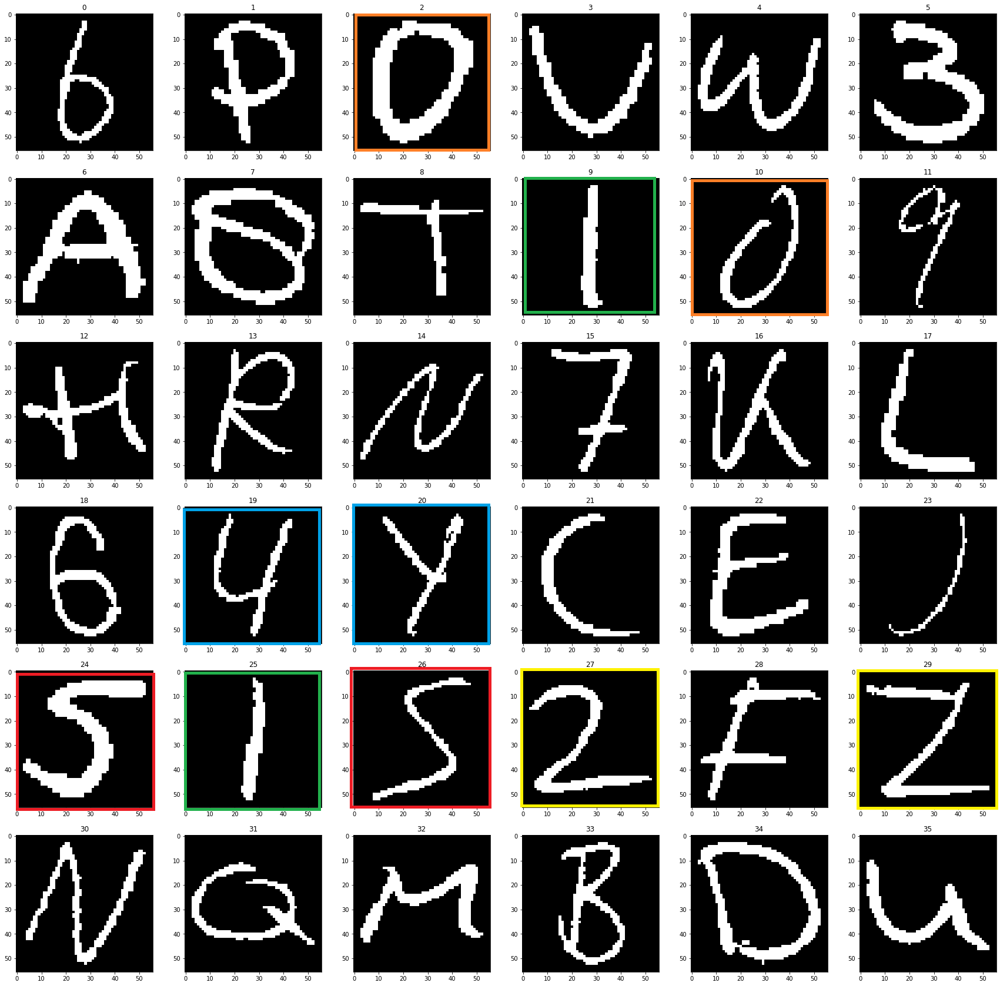
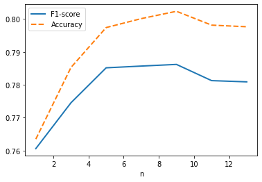

Results
=======

Triplet Network Results
-----------------------

The best set of hyperparameters is given by experiment No 5 and is put in bold. The best experiment was chosen based on the results presented in Table 2, namely based on obtained F1-score, Recall and Precision in a digit classification task on the testing set using a 1-NN classifier.

In addition, training and validation losses of each model are presented. The losses are the last recorded values before validation loss started to raise again, which indicates that the network started overfitting. Training loss and validation losses are margin dependent and so they allow to compare several models having the same margin. However, one should refrain from comparing models trained with different margins with these two metrics.

.. list-table:: Table 1. Triplet Network Experiments
   :header-rows: 1

   * - Experiment No
     - Embedding's Length
     - Data Augmentation
     - Image Count
     - Classes Count
     - Margin

   * - 1
     - 64
     - No
     - 100% + 3
     - 36
     - 1

   * - 2
     - 128
     - No
     - 100% + 3
     - 36
     - 1

   * - 3
     - 64
     - No
     - 100%
     - 35
     - 1

   * - 4
     - 64
     - Yes
     - 200%
     - 35
     - 1

   * - **5**
     - **64**
     - **No**
     - **100%**
     - **35**
     - **10**

   * - 6
     - 64
     - No
     - 100%
     - 35
     - 20

   * - 7
     - 64
     - Yes
     - 200%
     - 35
     - 10

In experiments 1 and 2, the initial dataset was extended with only 3 images representing the class 30, which is represented by "100% + 3".

.. list-table:: Table 2. Triplet Network Results
   :header-rows: 1

   * - Experiment No
     - Training Loss
     - Validation Loss
     - Testing F1
     - Testing Precision
     - Testing Recall

   * - 1
     - 0.169091
     - 0.212398
     - 0.757729
     - 0.755081
     - 0.763422

   * - 2
     - 0.331993
     - 0.261527
     - 0.756422
     - 0.754194
     - 0.762417
   * - 3
     - 0.120639
     - 0.221972
     - 0.740752
     - 0.739562
     - 0.744193
   * - 4
     - 0.234653
     - 0.319424
     - 0.662611
     - 0.660686
     - 0.667169
   * - **5**
     - **0.940140**
     - **1.445811**
     - **0.771555**
     - **0.769709**
     - **0.775063**
   * - 6
     - 0.675475
     - 3.144919
     - 0.743570
     - 0.742053
     - 0.746606
   * - 7
     - 1.171921
     - 2.646956
     - 0.722494
     - 0.720766
     - 0.726194

.. figure:: _static/images/confusion_matrix.png
   :width: 90%
   :alt: Confusion Matrix for the Embedding Network in Experiment 5
   :align: center

   Confusion Matrix for the Embedding Network in Experiment 5. Left: Expressed as the logarithm of the number of examples. Right: Expressed as the fraction of all examples in a class.

Confused classes are those that are very similar and often indistinguishable also for a human being:

* I and 1 (classes 9 and 25)
* O and 0 (classes 2 and 10)

and, to a lesser extend,

* Z and 2 (classes 27 and 29)
* S and 5 (classes 24 and 26)
* Y and 4 (classes 19 and 20).

   Original classes in the provided dataset with most confused classes marked

k-Nearest Neighbor Classifier
-----------------------------

In the evaluation of the best classifier performance with respect to the number of voting nearest neighbors. Embedded images constitute a considered population out of which neighbors are chosen.

   k-Nearest Neighbor Classifier Goodness\n with respect to the Number of Neighbors k

Best on the above results, k=9 was chosen as the best number of voting neighbors in the classifier.