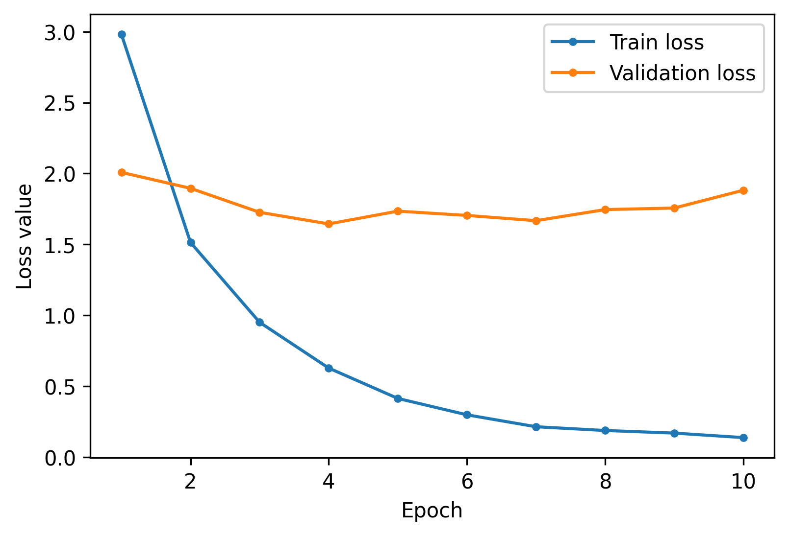
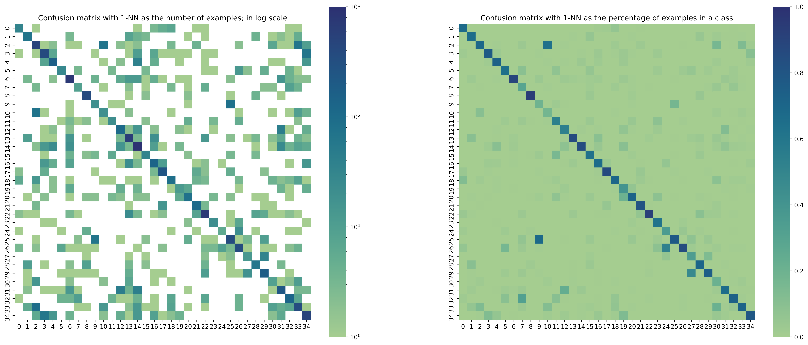

Results
=======

Triplet Network Results
-----------------------

The best set of hyperparameters is given by experiment No 5 and is put in bold. The best experiment was chosen based on the results presented in Table 2, namely based on obtained Accuracy, F1-score, Recall and Precision in a digit classification task on the validation set using a 1-NN classifier.

In addition, training and validation losses of each model are presented. The losses are the last recorded values before validation loss started to raise again, which indicates that the network started overfitting. Training loss and validation losses are margin dependent and so they allow to compare several models having the same margin. However, one should refrain from comparing models trained with different margins with these two metrics.

.. list-table:: Triplet Network Experiments
   :header-rows: 1

   * - Experiment No
     - Embedding's Length
     - Data Augmentation
     - Image Count
     - Classes Count
     - Margin

   * - 1
     - 64
     - No
     - 100% + 3
     - 36
     - 1

   * - 2
     - 128
     - No
     - 100% + 3
     - 36
     - 1

   * - 3
     - 64
     - No
     - 100%
     - 35
     - 1

   * - 4
     - 64
     - Yes
     - 200%
     - 35
     - 1

   * - **5**
     - **64**
     - **No**
     - **100%**
     - **35**
     - **10**

   * - 6
     - 64
     - No
     - 100%
     - 35
     - 20

   * - 7
     - 64
     - Yes
     - 200%
     - 35
     - 10

In experiments 1 and 2, the initial dataset was extended with only 3 images representing the class 30, which is represented by "100% + 3".

.. list-table:: Triplet Network Results
   :header-rows: 1

   * - Experiment No
     - Training Loss
     - Validation Loss
     - Validation Accuracy
     - Validation F1
     - Validation Precision
     - Validation Recall

   * - 1
     - 0.308352
     - 0.259931
     - 0.739787
     - 0.734569
     - 0.739787
     - 0.735852

   * - 2
     - 0.187157
     - 0.306954
     - 0.750433
     - 0.747955
     - 0.750433
     - 0.747597
   * - 3
     - 0.164134
     - 0.196031
     - 0.736008
     - 0.730271
     - 0.736008
     - 0.730938
   * - 4
     - 0.238456
     - 0.191708
     - 0.649827
     - 0.644341
     - 0.649827
     - 0.645733
   * - **5**
     - **0.628041**
     - **1.644687**
     - **0.763497**
     - **0.760123**
     - **0.763497**
     - **0.760612**
   * - 6
     - 1.100111
     - 1.481385
     - 0.707281
     - 0.700070
     - 0.707281
     - 0.701771
   * - 7
     - 1.022579
     - 3.379066
     - 0.734522
     - 0.731645
     - 0.734522
     - 0.731817

.. _target to loss:

   Values of training and validation loss functions in ten epochs in Experiment 5. The minimal validation loss was attained in the fourth epoch.

In :numref:`target to loss`, the training and validation losses in Experiment 5 are presented. The minimal validation loss is attained in epoch number 4 and increases afterwards. The default learning rate of 0.001 was used for training.

   Confusion Matrix for the Embedding Network in Experiment 5. Left: Expressed as the logarithm of the number of examples. Right: Expressed as the fraction of all examples in a class.

Confused classes are those that are very similar and often indistinguishable also for a human being:

* I and 1 (classes 9 and 25)
* O and 0 (classes 2 and 10)

and, to a lesser extend,

* Z and 2 (classes 27 and 29)
* S and 5 (classes 24 and 26)
* Y and 4 (classes 19 and 20).

.. _target to all_classes:

   Original classes in the provided dataset with pairs of most confused classes marked with the same color

In :numref:`target to all_classes` each class is represented by a sample image from this class. The most confused pairs of classes, listed above, are framed with the same color.

k-Nearest Neighbor Classifier
-----------------------------

In the evaluation of the best classifier performance with respect to the number of voting nearest neighbors. Embedded images constitute a considered population out of which neighbors are chosen. The evaluation was executed on the validation set.

.. figure:: _static/images/knn_errors.png
   :width: 70%
   :align: center
   :alt: k-Nearest Neighbor Classifier Performance

   k-Nearest Neighbor Classifier Goodness with respect to the Number of Neighbors k

Best on the above results, k=9 was chosen as the best number of voting neighbors in the classifier.

Results on the test set
-----------------------

The selected 9-NN classifier of embeddings of length 64 with triplet loss margin equal 10 into 35 classes attains the following performance metrics values on the test set:

- Accuracy = 0.802916
- Precision = 0.786258
- Recall = 0.802916
- F1-score = 0.787655

