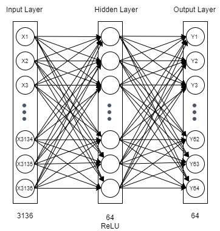
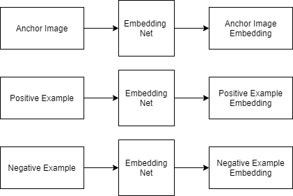
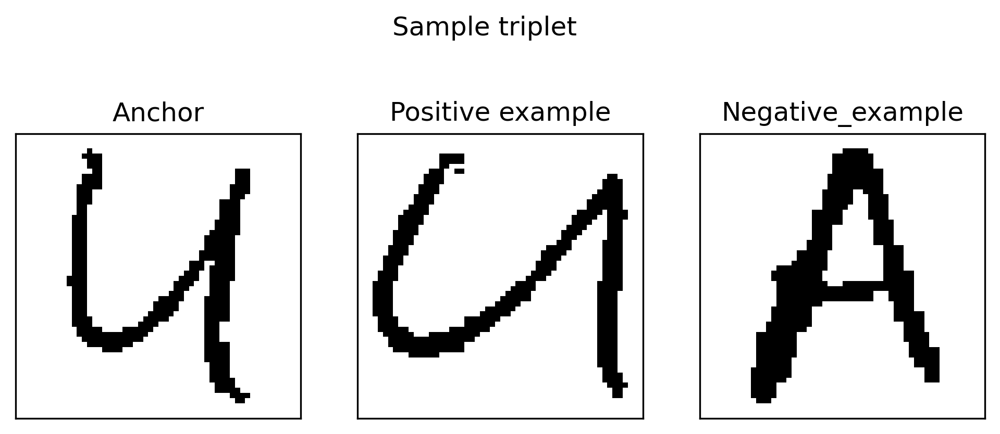

Method
======

Assumptions made during the initial development of a model were that each class represents a unique character. Under this assumption, one class, namely class No 30, contained only a single example. To address this situation, a two-step model is proposed:

* In the first step, each image is translated into an embedding. This step is accomplished by means of a fully-connected feedforward neural network with a single hidden layer.
* In the second step, a k-Nearest Neighbor (k-NN) classifier is trained to classify embeddings.

Transforming examples from image space into a space of image embeddings is an effective technique when only one or few examples are available for a class. The problem of having such a small number of examples per class is called "one-shot learning" or "few-shot learning", depending on whether a single or several examples are available.

In the course of the study it was determined that class 30 and class 14 both contain images representing the same letter N. The two classes were merged for further analyses. These changed circumstance shed a new light on the problem, however none of these new conditions is undermining the validity of the proposed approach.

It is recommended that alternative approaches are evaluated once the dataset is corrected.

In the remainder of this chapter details of the two steps of the proposed approach, namely:

* transformation of an image into an embedding, and
* training a k-NN classifier to classify embeddings,

are described.

Image Embedding Learning
------------------------
Embedding Network
~~~~~~~~~~~~~~~~~

Image embedding is retrieved as the output of a small neural network constructed as a fully connected feedforward neural network with one hidden layer and ReLU activation function.

   Fully connected feedforward neural network for embedding learning

Triplet Network
~~~~~~~~~~~~~~~

In order to learn the embeddings, a Triplet Network is used. A Triplet Network accepts as an input a triplet of examples, where:

* the first element is an anchor,
* the second element is a positive example i.e. another image from the same class,
* the third element is a negative example i.e. an image from a different class.

The goal is to learn the embeddings so that the L\ :sub:`2`\  distances between classes is maximized, that is the distance between an anchor and a positive example is small whereas the distance between an anchor and a negative example is large.

   Triplet-loss Network for Learning Image Embeddings

   Example triplet consisting of an anchor image, a positive example, and a negative example

A loss function utilized for training the Triplet Network is Triplet Loss, defined as:

.. math::

   L = \max( d(a, p) - d(a,n) + margin, 0)

where

* :math:`d` is the distance function
* :math:`a` is an anchor
* :math:`p` is a positive example
* :math:`n` is a negative example,
* :math:`margin` is a hyperparameter that defines how far away the classes should be.

Consult the :mod:`alphamoon.features.build_features` module for an implementation of the above networks.

k-Nearest Neightbors Classifier
-------------------------------

A k-nearest neighbors algorithm was chosen as a method for deciding to which class a given example belongs to.

The input consists of the k closest training examples in data set. In k-NN classification, the output is a class membership. An object is classified by a plurality vote of its neighbors, with the object being assigned to the class most common among its k nearest neighbors (k is a positive integer, typically small). If k = 1, then the object is simply assigned to the class of that single nearest neighbor.

An :class:`sklearn.neighbors.KNeighborsClassifier` implementation of k-NN algorithm was utilized.