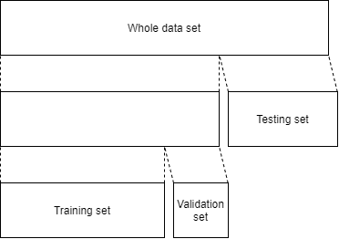

Training
========

Training of a model was executed in two phases.

In the first phase, the objective was to determine the best hyperparameters for the model. For that purpose the provided dataset was split into training, validation and testing subsets; the testing subset served the purpose of assessing the generalization ability of a trained model.

In the second phase, the objective was to train a final model using the predetermined hyperparameters' values. Here the training was executed on the whole provided dataset. No further evaluation of model's performance was executed.

For the implementation of phase 1 see :meth:`alphamoon.models.train_model.determine_best_model`, whereas phase 2 implementation can be found in :meth:`alphamoon.models.train_model.train_final_model`.

Phase One
---------

Train - Validation - Test Dataset Split
~~~~~~~~~~~~~~~~~~~~~~~~~~~~~~~~~~~~~~~

The provided data set was first divided into a training and a testing sets in the proportion 2:1. To ensure proportional representation of all classes in both sets, a :class:`sklearn.model_selection.StratifiedShuffleSplit` was utilized to accomplish the split.

The training dataset was further split, again by means of the ``StratifiedShuffleSplit`` class, into training and validation sets in the proportion 4:1.

The role of the validation set was to:

- ensure early stopping in case the Triplet Network started to overfit during its training,
- compare various sets of hyperparameters of the Triplet Network and select the best one,
- compare various numbers of neighbors `k` used in the k-NN classifier and select the best one.

The role of the testing set was to evaluate the proposed model's performance on an unseen dataset.

   Sequence of splitting provided dataset into three subsets: training, validation, and testing.

Training Procedure
~~~~~~~~~~~~~~~~~~

1. Read the data
2. Reassign class 30 to 14
3. Split the data into the training, validation, and testing sets
4. [Optional] Apply data augmentation transformations to the images in the training set

   Considered data augmentation included applying a random selection of transformations to an image:

   * random rotation of up to 10 degrees,
   * random horizontal and vertical scaling by the factor between 0.88 and 1.12, independent of each other,
   * random horizontal and vertical translation by up to 7 pixels in both directions, independent of each other.

   Each transformation was applied independently with probability 0.5.

5. Create an instance of the Triplet Network
6. Define:

   a. number of epochs
   b. margin for the triplet loss
   c. loss function (:class:`torch.nn.TripletMarginWithDistanceLoss`)
   d. optimizer (:class:`torch.optim.Adam`)

7. Move the model to CUDA if CUDA device is available.

8. For each candidate set of hyperparameters:
   a. train a Triplet Model on the training set while controlling for overfitting on the validation set.
   b. train a 1-Nearest Neighbor classifier on obtained embeddings from the training set
   c. calculate accuracy, precision, recall and F1-score for the trained classifier on the validation set.
9. Among all candidate sets of hyperparameters select the one that attains the highest F1-score.
10. Train the k-NN classifier for various k on the training set and choose k for which F1-score is maximized on the validation set

   Odd numbers between 1 and 15 were used for evaluation. Even numbers were not considered, since by rule they yielded worse results than surrounding odd numbers (the majority vote is undetermined if votes split 50:50 among an even number of voters). Numbers higher than 15 were not considered as they yielded numerical error indicating that such higher numbers might generate unstable or undetermined results.

11. Assess the overall model performance on the test set
12. Save the resulting model to a file

Phase Two
---------
In the second phase, the dataset is split into training and validation in the proportion of 4:1 and trained using the hyperparameters determined in the first phase. The obtained model is stored in files and exposed via :mod:`predict.predict` method.

